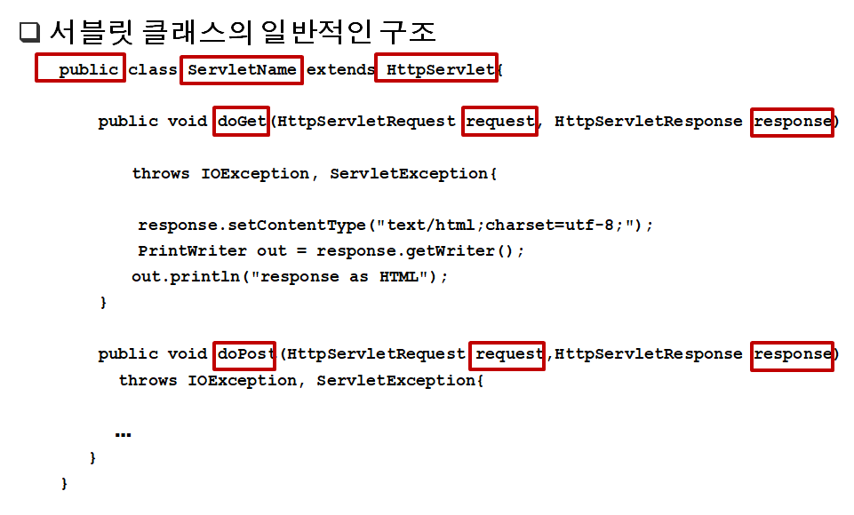
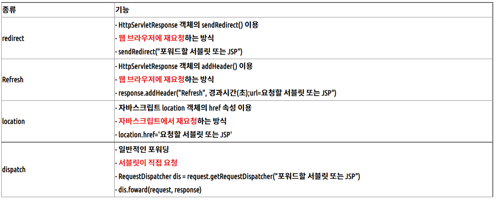
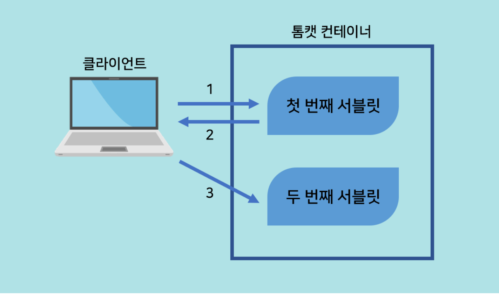
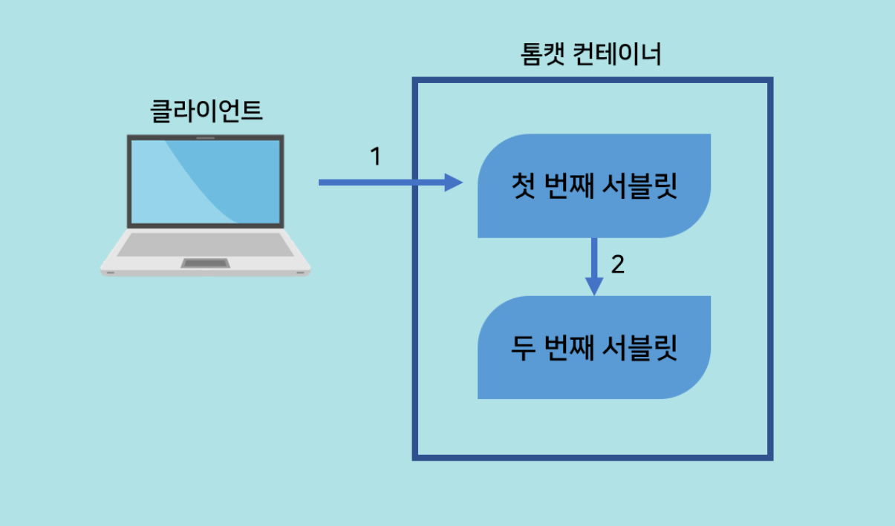
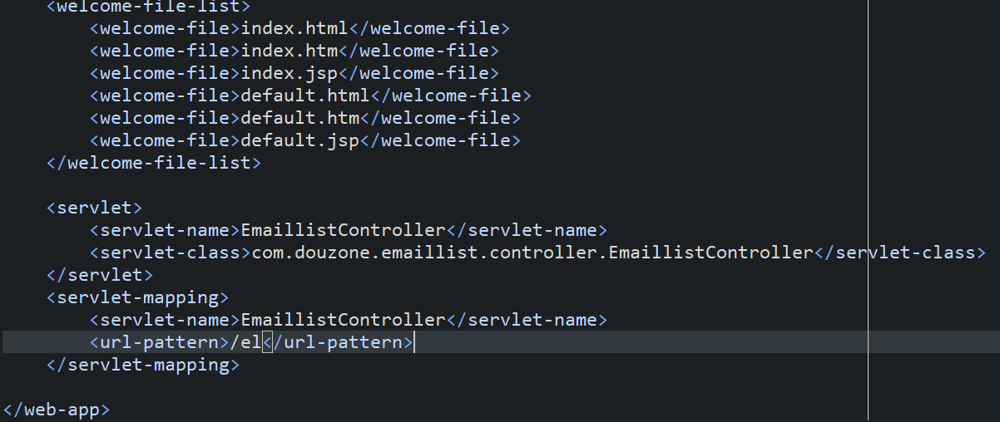

## Servlet 클래스 작성

### 서블릿 작성 방법

**서블릿은 HttpServlet 클래스를 상속받는다. HttpServlet 클래스를 사용하기 위해서는 javax.servlet, javax.servlet.http, 그리고 java.io 패키지를 임포트 해야 한다.**

**HttpServlet 클래스의 doGet 메소드를 재정의(overriding)하고, GET 방식을 사용하는 모든 HTTP 
 요청을 처리한다.**

**HttpServlet 클래스의 doPost 메소드를 재정의(overriding)하고, POST 방식을 사용하는 모든 HTTP 
 요청을 처리한다.**

**doGet과 doPost 메소드는 웹 서버가 전달한 두 개의 객체를 인자로 받는다 : (1) HttpServletRequest 
 객체(*request* 객체*)*, 그리고 (2) HttpServletResponse 객체(*response* 객체*)***

**response 객체의 setContentType 메소드는 브라우저에 전달되는 응답의 콘텐트 타입(content type)을 설정한다. ** 

**response 객체의 getWriter 메소드는 브라우저에 HTML 코드를 보내는 PrinterWriter 객체를 리턴한다.**

**getWriter 메소드가 적절한 PrintWriter 객체를 리턴하기 위해서는, 반드시 PrintWriter 객체를 생성하기 전에 콘텐트 타입을 설정해야 한다. **

## 포워드 

- 서블릿에서 서블릿, 서블릿에서 JSP로 연동하는 방법

- 요청에 대한 추가 작업을 다른 서블릿에게 수행하게 한다

- 요청에 포함된 정보를 다른 서블릿이나 JSP와 공유할 수 있다

- 요청에 정보를 포함시켜 다른 서블릿에게 전달할 수 있다

- 모델2 개발시 서블릿에서 JSP로 데이터를 전달하는데 사용

### 포워드 종류

## **redirect, refresh, location**

**1. 웹 브라우저에서 FirstServlet 을 요청한다**

  **2. FirstServlet은 sendRedirect()를 통해 SecondServlet을 웹 브라우저에 재요청한다**

  **3. 웹 브라우저는 SecondServlet을 다시 요청한다**

  **※ 이때 1, 2번에서의 요청, 응답객체와 3번에서의 요청, 응답객체는 서로 다르다!**

​    **(dispatch.forward 방식과 차이가 되는 특징이다)**

 **- redirect 방식으로 다른 서블릿에 데이터 전달하는 방법(GET 방식)**

​    **response.sendRedirect("second?name=park");**

##  **dispatch**

 **1. 웹 브라우저에서 FirstServlet을 요청한다**

  **2. FirstServlet은 RequestDispatcher를 이용해 SecondServlet으로 포워드한다**

  **※ 이때 1번에서 생성한 요청, 응답 객체를 2번에서 넘겨준다**

​    **(1번과 2번 응답, 요청 객체가 서로 같다는 점에서 redirect 방식과 차이를 갖는다)**

## web-xml 세팅

**url pattern은 여러개 매핑가능**

